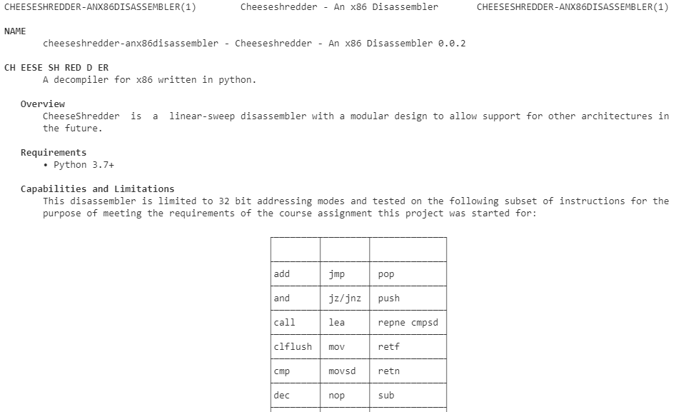

# Cheese Shredder

A decompiler for x86 written in python.

## Overview

CheeseShredder is a linear-sweep disassembler with a modular design to allow support for other architectures in the
future.

### Requirements

- Python 3.7+

### Capabilities and Limitations

This disassembler is limited to 32 bit addressing modes and tested on the following subset of instructions for the
purpose of meeting the requirements of the course assignment this project was started for:

| | | |
|-|-|-|
|add|jmp|pop|
|and|jz/jnz|push|
|call|lea|repne cmpsd|
|clflush|mov|retf|
|cmp|movsd|retn|
|dec|nop|sub|
|idiv|not|test|
|inc|or|xor|

References used for this project was primarily the Intel® 64 and IA-32 Architectures Software Developer’s Manual [1]. A
csv of the instructions with metadata about them was also used and modified from Gregory Comer on their github
project GregoryComer/x86-csv [2]. Initially this was added as a submodule, but some formatting adjustments needed to
be made for instructions such as `PUSH 50+rd` where in the source csv the opcodes are denoted as "50 +rd" and to make
implementation easier such instructions were reduced to a single operand token of `50+rd`.

## Quick-Start

Clone or decompress the release tar.gz/zip to a directory of your choosing. Then run `pip install .` in the target
directory.

### Linux

```bash
wget https://github.com/nuvious/CheeseShredder/archive/refs/tags/latest.tar.gz -O CheeseShredder-latest.tar.gz
tar -xvf CheeseShredder-latest.tar.gz
cd CheeseShredder-latest
pip3 install .
cheeseshredder -i tests/positive/example1
```

### Windows

```powershell
Invoke-WebRequest https://github.com/nuvious/CheeseShredder/archive/refs/tags/latest.zip `
    -OutFile CheeseShredder-latest.zip
Expand-Archive CheeseShredder-latest.zip -DestinationPath .
cd CheeseShredder-latest
pip install .
cheeseshredder -i tests\positive\example1
```

### Example Output

```bash
(.venv) $> xxd tests/positive/example1
00000000: 31c0 01c8 01d0 5589 e552 51b8 4443 4241  1.....U..RQ.DCBA
00000010: 8b95 0800 0000 8b8d 0c00 0000 01d1 89c8  ................
00000020: 5a59 5dc2 0800                           ZY]...
(.venv) $> cheeseshredder -i tests/positive/example1
00000000: 31C0 xor eax,eax
00000002: 01C8 add eax,ecx
00000004: 01D0 add eax,edx
00000006: 55 push ebp
00000007: 89E5 mov ebp,esp
00000009: 52 push edx
0000000A: 51 push ecx
0000000B: B844434241 mov eax,0x41424344
00000010: 8B9508000000 mov edx,[ebp+0x00000008]
00000016: 8B8D0C000000 mov ecx,[ebp+0x0000000c]
0000001C: 01D1 add ecx,edx
0000001E: 89C8 mov eax,ecx
00000020: 5A pop edx
00000021: 59 pop ecx
00000022: 5D pop ebp
00000023: C20800 retn 0x0008
```

## Usage

You can use the `-h` flag to see all the command line option:

```bash
(.venv) $> cheeseshredder -h
usage: CheeseShredder [-h] -i INPUT [-d] [-p] [-l LOG_LEVEL] [-f] [--no-jump-label] [-o OUTPUT]

A binary disassembler for x86 32 bit addressing mode binaries.

options:
  -h, --help            show this help message and exit
  -i INPUT, --input INPUT
                        Input file to disassemble.
  -d, --debug           Sets debug mode; throws exceptions on any parse error.
  -p, --progress        Show progress bar (requires tqdm).
  -l LOG_LEVEL, --log-level LOG_LEVEL
                        Set log level.
  -f, --label-functions
                        Label function locations and calls with func_XXXXXXXX.
  --no-jump-label       Do not label jumps with offset_XXXXXXh format and just output the immediate value.
  -o OUTPUT, --output OUTPUT
                        Output to a file. If not set output will print to stdout.

For questions/contributions email5287736+nuvious@users.noreply.github.com.
```

### Jump and Function Labels

Jump labels are on by default and will have the syntax `offset_XXXXXXXXh`. These can be disabled with the
`--no-jump-label` flag. Example output below:

```text
000000AF: 31D2 xor edx,edx
offset_000000b1h: <----
000000B1: 8B06 mov eax,[esi]
...
000000BF: 39D1 cmp ecx,edx
000000C1: 75EE jnz offset_000000b1h <----
000000C3: 5A pop edx
```

Function labels are off by default and can be turned on with the `-f/--label-functions` flag. Function labels will take
the format of `func_XXXXXXXX`. Example output below:

```text
0000009E: C3 retn
func_0000009f: <---
0000009F: 55 push ebp
...
00000056: 51 push ecx
00000057: E843000000 call func_0000009f <---
0000005C: B91C000000 mov ecx,0x0000001c
```

## Docker

A Dockerfile definition has been provided and can be built locally or pulled from DockerHub. Simply mount you desired
binary to `/workspace` and use the same relative paths (unix style) to run the disassembler.

```bash
docker run --rm -it -v $PWD:/workspace nuvious/cheeseshredder -i tests/positive/example1
```

To build from the Dockerfile simply run `docker build` and use your desired local tag:

```bash
docker build -t cheeseshredder .
docker run --rm -it -v $PWD:/workspace cheeseshredder -i tests/positive/example1
```

## Development and Testing

For development, a [tox](https://tox.wiki/en/4.13.0/) configuration has been made to test compatibility with all
actively supported versions of python.

### Using Docker/Conda/Tox (Recommended)

```bash
docker run --rm -it \
    -v ${PWD}:/workspace conda/miniconda3:latest \
    /bin/bash -c "pushd workspace; pip install tox-conda; tox"
```

### Locally with pytest

```bash
git clone https://github.com/nuvious/CheeseShredder.git
cd CheeseShredder
# Setup a virtual environment if desired
pip install -e .[test]
pytest
```

### Fuzzing

A script is also provided to fuzz input to find edge cases. The script will generate a random binary via /dev/urandom
and then run the disassembler on it.

```bash
cd tests
/bin/bash fuzz_it.sh
```

If a payload is found that causes an exception, then it will be copied with the output to fuzz/test_case_NN(.out). The
`test_fuzz.py` will then pick it up and should result in a failed pytest run. This allows for test-driven development
of edge cases and/or bugs in parsing.

### Build Documentation

This project uses [sphinx](https://www.sphinx-doc.org/en/master/) to generate documentation. Docs can be built by
running the `make` build targets:

```bash
# PDF 
make latexpdf
# Artifact will be located at docs/build/latex/cheeseshredder-anx86disassembler.pdf

# HTML
make html
# Artifacts will be located at docs/build/html
tar -czvf cheeseshredder-docs-html.tar.gz -C docs/build html
```

This can also generate a man-page that you can include in one of your `man --path` locations.

```bash
# MAN Page
make man
# Artifact will be located at docs/build/man/cheeseshredder-anx86disassembler.1
cp docs/build/man/cheeseshredder-anx86disassembler.1 /usr/share/man/man1/cheeseshredder.1
```

[comment]: # (There are two includes of this image because this markdown is included by the sphinx build so the path needs to be relative to the README.md and the docs/ build directory)




## References

[1] Intel, “Intel® 64 and IA-32 Architectures Software Developer’s Manual,” 2023.
    Available: https://cdrdv2.intel.com/v1/dl/getContent/671110. [Accessed: Jan. 30, 2024]

[2] G. Comer, “GregoryComer/x86-csv,” GitHub, Oct. 23, 2023.
    Available: https://github.com/GregoryComer/x86-csv. [Accessed: Feb. 19, 2024]
